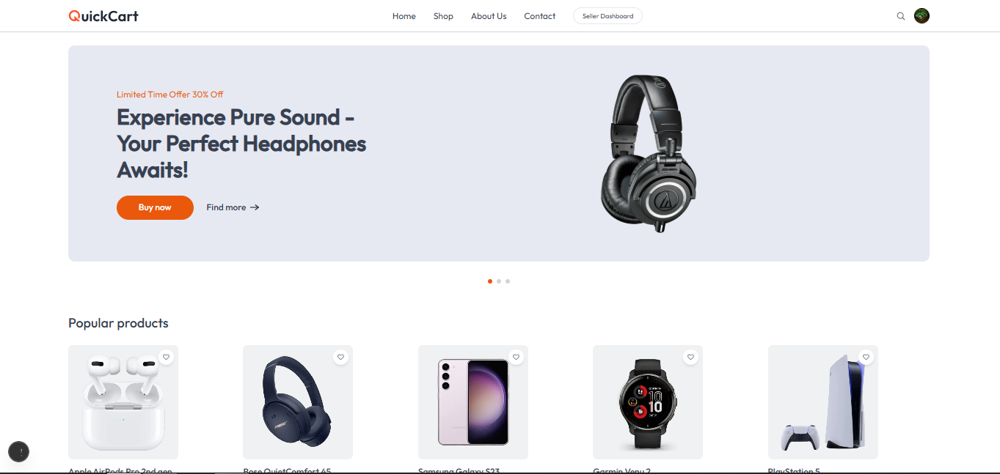
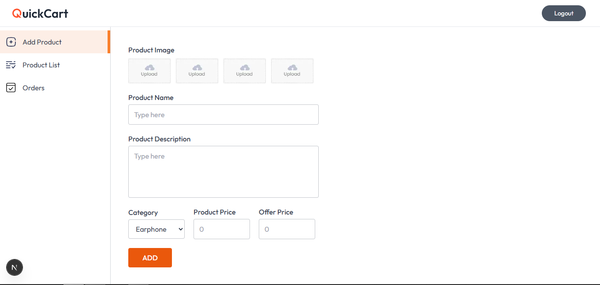

# 🛒 QuickBuy – E-Commerce Platform

QuickBuy is a full-stack **Next.js application** that allows users to browse products, manage their accounts via **Clerk**, and for authorized sellers to showcase their products.  
The platform integrates **Inngest** for event-driven workflows and **MongoDB** for database storage.

---

## ✨ Features

- 👤 **User Authentication & Roles** powered by **Clerk**
- 🛍️ **Seller Dashboard** – visible only for accounts with seller role
- 📦 Product management (add, update, delete)
- 📑 Event-driven workflows using **Inngest** (sync user creation, updates, and deletions)
- 🗄️ Data persistence with **MongoDB Atlas**
- 🌐 Built as a **Next.js full-stack app** (frontend + backend in one)

---

## 🛠️ Tech Stack

- **Frontend & Backend**: Next.js (App Router)
- **Styling**: TailwindCSS
- **Authentication**: Clerk (User management, roles)
- **Database**: MongoDB Atlas with Mongoose ODM
- **Events**: Inngest (handling user sync from Clerk → MongoDB)
- **Hosting**: Vercel (Next.js full-stack deployment)

---

## 📸 Screenshots

### 🏠 Home Page



### 📦 Seller Dashboard



---

## ⚙️ DevOps & System Design

- **Deployment**:
  - Hosted on **Vercel** (frontend + backend in one project)
  - MongoDB Atlas for cloud database
- **Monitoring & Observability**:
  - Inngest logs for event processing
  - MongoDB Atlas monitoring tools for queries and cluster health
- **System Design Principles**:
  - **RBAC (Role-Based Access Control)** for seller dashboard
  - **Event-driven architecture** (Clerk webhooks trigger Inngest → MongoDB updates)
  - Stateless API routes in Next.js for scalability
  - Optimized MongoDB schema for user and product data

---

## 🗄️ Database (MongoDB Atlas)

QuickBuy uses **MongoDB Atlas** for storing **users** and **products**.

### 🔌 Connecting to MongoDB Atlas

1. Create a [MongoDB Atlas](https://www.mongodb.com/cloud/atlas) account.
2. Setup a cluster and whitelist IP or allow `0.0.0.0/0`.
3. Create a database user.
4. Copy your **MongoDB URI**:

mongodb+srv://<username>:<password>@cluster0.xxxxx.mongodb.net/quickbuy

markdown

5. Add it to your `.env.local` file in the project root:

MONGODB_URI="mongodb+srv://<username>:<password>@cluster0.xxxxx.mongodb.net/quickbuy"
CLERK_SECRET_KEY="your-clerk-secret"
NEXT_PUBLIC_CLERK_PUBLISHABLE_KEY="your-clerk-publishable-key"
INNGEST_SIGNING_KEY="your-inngest-signing-key"
INNGEST_EVENT_KEY="your-inngest-event-key"

6. Example `db.js` connection:

```js
import mongoose from "mongoose";

let cached = global.mongoose;

if (!cached) {
  cached = global.mongoose = { conn: null, promise: null };
}

async function connectDB() {
  if (cached.conn) return cached.conn;
  if (!cached.promise) {
    cached.promise = mongoose.connect(process.env.MONGODB_URI, {
      bufferCommands: false,
    }).then((mongoose) => mongoose);
  }
  cached.conn = await cached.promise;
  return cached.conn;
}

export default connectDB;
🔑 Authentication (Clerk)
Clerk manages sign up, login, and session handling.

Each user can be assigned a role (e.g., seller).

The seller dashboard is only visible to users with the seller role.

Example usage:

js

import { auth } from "@clerk/nextjs";

export default function Dashboard() {
  const { userId, sessionClaims } = auth();

  if (sessionClaims?.role !== "seller") {
    return <p>Access denied</p>;
  }

  return <SellerDashboard />;
}

⚡ Inngest Integration
QuickBuy uses Inngest functions to keep Clerk and MongoDB in sync.

User Creation → Clerk event triggers Inngest → MongoDB user document created

User Update → Clerk event triggers Inngest → MongoDB document updated

User Deletion → Clerk event triggers Inngest → MongoDB document deleted

Example function:

js

import { Inngest } from "inngest";
import connectDB from "@/lib/db";
import User from "@/models/User";

export const inngest = new Inngest({ id: "quickbuy" });

export const syncUserCreation = inngest.createFunction(
  { id: "sync-user-form-clerk" },
  { event: "clerk/user.created" },
  async ({ event }) => {
    await connectDB();
    await User.create({
      id: event.data.id,
      email: event.data.email_addresses[0].email_address,
      name: `${event.data.first_name} ${event.data.last_name}`,
      imageUrl: event.data.image_url,
      role: "buyer",
    });
  }
);

🧪 Tests

✅ Unit Tests

Next.js components (e.g., product cards, auth buttons)

Utility functions (form validation, price formatting)

🔗 Integration Tests

Clerk authentication with protected routes

Inngest events syncing user data into MongoDB

Product CRUD API routes

📊 Test Results
yaml

PASS  tests/api/products.test.js
PASS  tests/api/auth.test.js
PASS  tests/inngest/userSync.test.js

Test Suites: 3 passed, 3 total
Tests:       28 passed, 28 total
Snapshots:   0 total
Time:        8.214s


🚀 Getting Started
Prerequisites
Node.js >= 18

MongoDB Atlas account

Clerk account (for auth)

Inngest account (for event workflows)

Installation

Edit
# Clone repository
git clone https://github.com/your-username/quickbuy.git

cd quickbuy
npm install
Create .env.local in the project root:

ini

MONGODB_URI="your-mongodb-uri"
CLERK_SECRET_KEY="your-clerk-secret"
NEXT_PUBLIC_CLERK_PUBLISHABLE_KEY="your-publishable-key"
INNGEST_SIGNING_KEY="your-inngest-signing-key"
INNGEST_EVENT_KEY="your-inngest-event-key"

Run locally:
npm run dev
Open [http://localhost:3000](http://localhost:3000) with your browser to see the result.

📬 Feedback
This project is open for contributions.
If you’d like to collaborate, open a PR or raise an issue.

For direct inquiries, see my portfolio.


```
